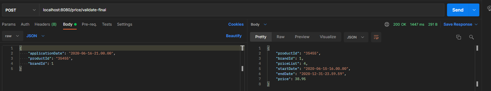

# INDITEX EXAMPLE PROJECT

## Technologies

- Ports and adapters architecture
- Java 8+
- Gradle 6.8.1
- Spring Framework
- H2 Database

## Project Structure

```sh
INDITEX
|   .gitignore
|   build.gradle
|   gradlew
|   gradlew.bat
|   HELP.md
|   README.md
|   settings.gradle
|   
+---.gradle
|   |   file-system.probe
|   |   
|   +---6.8.1
|   |   |   gc.properties
|   |   |   
|   |   +---executionHistory
|   |   |       executionHistory.bin
|   |   |       executionHistory.lock
|   |   |       
|   |   +---fileChanges
|   |   |       last-build.bin
|   |   |       
|   |   +---fileHashes
|   |   |       fileHashes.bin
|   |   |       fileHashes.lock
|   |   |       resourceHashesCache.bin
|   |   |       
|   |   +---javaCompile
|   |   |       classAnalysis.bin
|   |   |       jarAnalysis.bin
|   |   |       javaCompile.lock
|   |   |       taskHistory.bin
|   |   |       
|   |   \---vcsMetadata-1
|   +---buildOutputCleanup
|   |       buildOutputCleanup.lock
|   |       cache.properties
|   |       outputFiles.bin
|   |       
|   +---checksums
|   |       checksums.lock
|   |       md5-checksums.bin
|   |       sha1-checksums.bin
|   |       
|   +---configuration-cache
|   |       gc.properties
|   |       
|   \---vcs-1
|           gc.properties
|           
+---.idea
|   |   .gitignore
|   |   compiler.xml
|   |   gradle.xml
|   |   jarRepositories.xml
|   |   misc.xml
|   |   runConfigurations.xml
|   |   uiDesigner.xml
|   |   vcs.xml
|   |   workspace.xml
|   |   
|   \---sonarlint
|       \---issuestore
|               index.pb
|               
+---gradle
|   \---wrapper
|           gradle-wrapper.jar
|           gradle-wrapper.properties
|           
\---src
    +---main
    |   +---java
    |   |   \---com
    |   |       \---example
    |   |           \---inditex
    |   |               |   InditexApplication.java
    |   |               |   
    |   |               +---application
    |   |               |   +---mappers
    |   |               |   |       PriceMapper.java
    |   |               |   |       
    |   |               |   +---ports
    |   |               |   |       PricePersistencePort.java
    |   |               |   |       PriceServicePort.java
    |   |               |   |       
    |   |               |   \---service
    |   |               |           PricePersistenceServiceImpl.java
    |   |               |           PriceServiceImpl.java
    |   |               |           
    |   |               +---config
    |   |               |       PriceConfig.java
    |   |               |       
    |   |               +---domain
    |   |               |   |   Price.java
    |   |               |   |   
    |   |               |   \---exception
    |   |               |           BusinessException.java
    |   |               |           PriceNotFoundException.java
    |   |               |           
    |   |               \---infrastructure
    |   |                   +---adapters
    |   |                   |   |   PriceAdapter.java
    |   |                   |   |   
    |   |                   |   +---dto
    |   |                   |   |       PriceRequest.java
    |   |                   |   |       PriceResponse.java
    |   |                   |   |       
    |   |                   |   +---exception
    |   |                   |   |       ControllerAdvisor.java
    |   |                   |   |       ErrorResponse.java
    |   |                   |   |       
    |   |                   |   \---mappers
    |   |                   |           PriceResponseMapper.java
    |   |                   |           
    |   |                   +---entity
    |   |                   |       PriceEntity.java
    |   |                   |       
    |   |                   \---repository
    |   |                           PriceRepository.java
    |   |                           
    |   \---resources
    |       |   application.yml
    |       |   data.sql
    |       |   schema.sql
    \---test
        \---java
            \---com
                \---example
                    \---inditex
                        |   InditexApplicationTests.java
                        |   
                        +---application
                        +---domain
                        \---infrastructure
                            |   Sample.java
                            |   
                            \---adapters
                                    PriceAdapterAcceptanceTest.java
```
## Example
